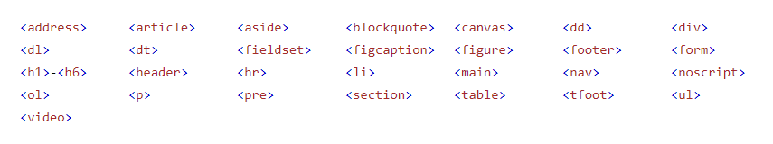
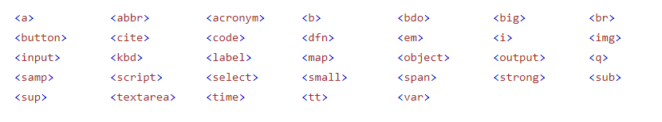
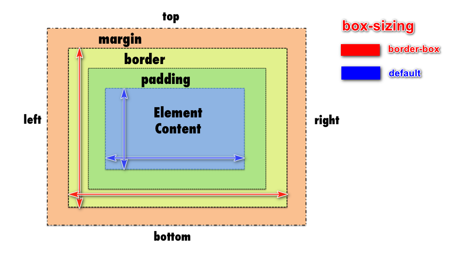
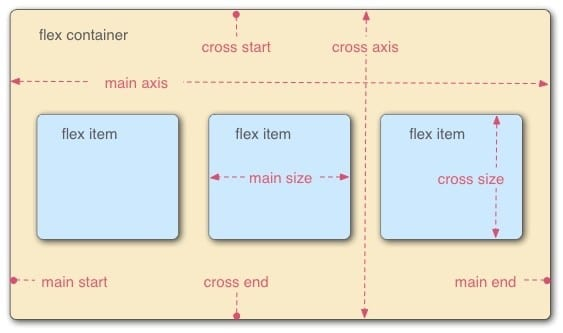

# **_Khóa học HTML_**

- Author: <diep.le@0004s.com>
- Create at : 03/2021

---

## Cài đặt môi trường. Làm quen với Dev tools

- Cài đặt vscode
  > [Link download](https://code.visualstudio.com/Download)
- Cài đặt Extension cho vscode
  - [Material](https://marketplace.visualstudio.com/items?itemName=PKief.material-icon-theme): Theme
  - [vscode-icons](https://marketplace.visualstudio.com/items?itemName=vscode-icons-team.vscode-icons): Icon
  - [GitLens](https://marketplace.visualstudio.com/items?itemName=eamodio.gitlens): Xem lịch sử sửa đổi trên git ngay dòng code.
  - [Bracket Pair Colorizer](https://marketplace.visualstudio.com/items?itemName=CoenraadS.bracket-pair-colorizer): Tô màu các dấu ()[]{}
  - [Code Spell Checker](https://marketplace.visualstudio.com/items?itemName=streetsidesoftware.code-spell-checker): Check chính tả trong khi code
  - [Live Server](https://marketplace.visualstudio.com/items?itemName=ritwickdey.LiveServer): Dựng 1 server chạy HTML/CSS/JS, tự động refresh trình duyệt mỗi khi bạn sửa code.
  - [Auto Rename Tag](https://marketplace.visualstudio.com/items?itemName=formulahendry.auto-rename-tag) & [Auto Close Tag](https://marketplace.visualstudio.com/items?itemName=formulahendry.auto-close-tag): Khi code HTML/JSX, mỗi khi tạo thêm tag mới, extension sẽ đóng tag để khỏi quên. Khi đổi tên tag, extension này sẽ đổi tên closing tag cho phù hợp luôn.
  - [Path Intellisense](https://marketplace.visualstudio.com/items?itemName=christian-kohler.path-intellisense): tự động chỉ đường dẫn.
  - [Prettier](https://marketplace.visualstudio.com/items?itemName=esbenp.prettier-vscode): hỗ trợ format code
  - [HTML](https://marketplace.visualstudio.com/items?itemName=abusaidm.html-snippets): Nhắc lệnh HTML

---

## **HTML, CSS** là gì?

- HTML
  - HTML là ngôn ngữ đánh dấu siêu văn bản (**HyperText Markup Language** - HTML) được sử dụng trong việc tạo trang web và các loại tài liệu khác có thể xem được bằng trình duyệt.
  - HTML là một tiêu chuẩn quốc tế, được duy trì bởi World Wide Web Consortium - Liên hợp Web toàn cầu.
  - Phiên bản hiện tại là HTML5, HTML5 vẫn đang trong quá trình phát triển.
- CSS
  - **Cascading Style Sheets**, viết tắt là CSS, là một ngôn ngữ định kiểu được sử dụng để mô tả việc trình bày một tài liệu được viết bằng HTML or XML (bao gồm các ngôn ngữ khác nhau như XML, SVG or XHTML).
  - CSS mô tả cách các phần tử được hiển thị trên màn hình, trên giấy, trong lời nói, hoặc trên các phương tiện khác.
  - Phiên bản hiện tại là CSS3

---

### Cấu trúc file HTML

```javascript:
<!DOCTYPE html>
<html lang="en">

<head>
  <title>Page Title</title>
  <meta charset="UTF-8">
  <meta name="viewport" content="width=device-width, initial-scale=1.0">
</head>

<body>
  <h1>This is a Heading 1</h1>
  <div>
    <p>This is a paragraph.</p>
  </div>
</body>
</html>
```

- `<!DOCTYPE html>`:— loại tài liệu.

- `<html></html>` — thành phần `<html>`. Thành phần này bao bọc tất cả nội dung trên toàn bộ trang và đôi khi được gọi là phần tử gốc.

- `<head></head>`: Là nơi chứa tất cả những nội dung bạn muốn đưa vào trang HTML không phải nội dung bạn hiển thị cho người xem trang của bạn. Điều này bao gồm những thứ như keywords và mô tả trang mà bạn muốn xuất hiện trong kết quả tìm kiếm, CSS tạo kiểu cho nội dung, khai báo bộ ký tư và những thứ khác.

- `<meta charset="utf-8">`: thành phần này đặt tài liệu của bạn sử dụng ký tự ở định dạng UTF-8, hầu hết các ký tự phần lớn là các ngôn ngữ chữ viết của con người. Về cơ bản, bây giờ nó có thể xử lý bất kỳ nội dung có thể đặt trên đó.

- `<title></title>`: Điều này đặt tiêu đề cho trang của bạn, là tiêu đề xuất hiện trong tab trình duyệt đang được tải.

- `<body></body>`: Nơi chứa tất cả nội dung mà bạn muốn hiển thị cho người dùng web khi họ truy cập trang của bạn, cho đó là văn bản, hình ảnh, video, trò chơi, bản âm thanh có thể phát hoặc bất kỳ nội dung nào khác.

### Cấu trúc của một thành phần HTML

> 

### Comments trong HTML

```javascript:
  <!-- <h1>This is a Heading 1</h1> -->
  <!-- comment block -->
```

### Thẻ HTML

- Thẻ thông dụng:
  > Thẻ cặp bắt buộc có thẻ đóng

```javascript:
<!-->
<!DOCTYPE>
<html>
<head>
<title>
<meta>
<script>
<style>
<body>
<div>
<h1> - <h6>
<p>
<span>
<form>
<button>
<a>
```

> Thẻ rỗng không có thẻ đóng

```javascript:

<input>
<br>
<hr>
```

- Những thẻ khác:

  > Link tham khảo [HTML-Elements](https://developer.mozilla.org/en-US/docs/Web/HTML/Element)

### HTML attributes (Thuộc tính của thẻ HTML)

[Link tham khảo](https://developer.mozilla.org/en-US/docs/Web/HTML/Global_attributes)

> 

- Thuộc tính thường dùng
  - class
  ```html:
  <p class="class1 class2">Above point sounds a bit obvious. Remove/rewrite?</p>
  ```
  - id
  ```html:
  <p id="id1">Above point sounds a bit obvious. Remove/rewrite?</p>
  ```
  - type, name, value, placeholder, checked, disabled:
  ```html:
  <input type="text" name="user" value="" placeholder="" >
  <input type="checkbox" checked />
  <input type="button" disabled>
  ```
- Sự kiện thường dùng
  - onclick: Sự kiện click vào element.
  - onchange: Sự kiện thay đổi giá trị ở các thẻ input.
  - onkeydown: Sự kiện nhấn phím .
  - onmouseenter: Sự kiện di chuột lên element.
  - onmouseleave: Sự kiện di chuột ra khỏi element.
  - onsubmit: Sự kiện submit form nhập liệu.

## Sử dụng CSS trong HTML

### Cú pháp

```css:
Selector {
  Property : value;
}
```

- Selector: Bộ chọn thành phần trong html -> [Các kiểu chọn](https://www.w3schools.com/cssref/css_selectors.asp)
- Property: Thuộc tính css-> [List thuộc tính](https://www.w3schools.com/cssref/)
- value: Giá trị của thuộc tính

### Ví dụ

- tag selector
  ```css:
  p {
    background-color: yellow;
    color: red;
    font-size: 24px;
  }
  ```
- class selector
  ```css:
  .class1 {
    background-color: yellow;
    color: red;
    font-size: 24px;
  }
  ```
- id selector
  ```css:
  #id1 {
    background-color: yellow;
    color: red;
    font-size: 24px;
  }
  ```

### Inline and block Element

- Here are the block-level elements in HTML:

  

- Here are the inline elements in HTML:

  

## Độ ưu tiên trong CSS

- External: Định nghĩa bên ngoài hoặc thư viện bên ngoài sau đó liên kết vào file html qua thẻ link

```css:
  <link rel="stylesheet" href="styles/style.css">
```

- Internal: Định nghĩa ngay bên trong file html với cặp thẻ
  ```:
  <style>
    h1 {
        color: blue;
        background-color: yellow;
        border: 1px solid black;
      }
  </style>
  ```
- Inline: Định nghĩa ngay bên trong thẻ với attribute style

```:
  <h1 style="color: blue;">Hello World!</h1>
```

### Biến và hàm trong CSS

```css:
  :root {
  --blue: #1e90ff;
  --white: #ffffff;
  --width: 1200px;
  }

  body {
    background-color: var(--blue);
    width: calc(var(--width) - 30px);
    }
```

### Đơn vị trong CSS

- Tuyệt đối
  - px : điểm ảnh màn hình hiển thị
  - cm
  - inch
- Tương đối
  - % : phụ thuộc vào kích thước thẻ cha
  - rem : phụ thuộc thuộc tính font-size của thẻ html (defaut 16px=1rem)
  - em : phụ thuộc vào thuộc tính font-size của thẻ cha, ông ...
  - vw : viewport-width
  - vh : viewport-height

## CSS Padding-Border-Margin



## CSS Background

### Background Color

- Color: (Cú pháp)

  - rgb(red,green,blue) : rgb(255,255,255)
  - rgba(red,green,blue,alpha) : rgba(255,255,255,0.5)
  - #ffffff -> #000000
  - #ffffffff -> #00000000
  - red, blue, green, white, black
    > [List of colors](https://en.wikipedia.org/wiki/List_of_colors:_A%E2%80%93F)

- background-clip:
  - default: padding-box

### Background Image

- Cú pháp:

  ```css:
  .box {
    background-image: url(./images/block.png);
    background-repeat: no-repeat;
    background-position: center top;
    background-size: contain;
    <!-- background-origin: padding-box;  -->
  }
  ```

  - or:

  ```css:
  .body {
    background: url(./images/block.png) no-repeat center top /contain;
  }
  ```

## CSS Position

- Relative
- Absolute
- Fixed
- Sticky

### Độ ưu tiên

> z-index : 0 ~ 999...

## CSS Flex box

[Link tham khảo](https://www.w3schools.com/css/css3_flexbox.asp)
Dưới đây là sơ đồ cấu trúc Flexbox.


- Hai thành phần quan trọng nhất trong một bố cục Flexbox là gồm flex-container và flex-item:

  - flex-container: là thành phần lớn bao quanh các phần tử bên trong.
  - flex-item: Các phần tử con của container được gọi là item, ở item bạn có thể thiết lập nó sẽ sử dụng bao nhiêu cột trong một container, hoặc thiết lập thứ tự hiển thị của nó.

- Ngoài hai thành phần chính đó, chúng ta có thể thấy hình trên sẽ có:

  - main start, main end: Khi thiết lập flexbox, điểm bắt đầu của container gọi là main start và điểm kết thúc được gọi là main end. Điều này có nghĩa, các item bên trong sẽ heienr thị từ main start đến main end (hoặc là được phép hiển thị đến main end). Và chiều vuông góc của nó là cross start, cross end cũng có ý nghĩa tương tự nhưng luôn vuông góc với main start, main end.
  - main axis: Trục này là trục chính để điều khiển hướng mà các item sẽ hiển thị. Như bạn thấy ở trên hình main axis là trục dọc nên các item sẽ hiển thị theo chiều dọc, tuy nhiên ta có thể sử dụng thuộc tính flex-direction để thay đổi trục của main axis và lúc đó các item sẽ hiển thị theo nó. Và cross axis luôn là trục vuông góc của main axis.
  - main size: Bạn có thể hiểu đơn giản là kích thước (chiều rộng hoặc dọc) của mỗi item dựa theo trục main axis.
  - cross size: Là kích thước (chiều rộng hoặc dọc) của mỗi item dựa theo trục cross axis.

- Cú pháp

  - khai báo 1 element là 1 flex box

  ```css:
    element {
      display: flex;
      }
  ```

- Các thuộc tính của Container flex
  - flex-direction : Chiều trục chính
  - flex-wrap : Bọc hay không các item bên trong
  - flex-flow : kết hợp flex-direction và flex-wrap
  - justify-content : Căn chỉnh theo trục chính
  - align-items : Căn chỉnh theo trục phụ
  - align-content : Căn chỉnh item theo không gian container
- Các thuộc tính của Item flex
  - order : Thứ tự xuất hiện
  - flex-grow : Mức độ chiếm hữu tối đa diện tích khi cần phải lấp đầy container
  - flex-shrink: Mức độ co lại tối thiểu khi container không đủ diện tích
  - flex-basis: gán cho item kích thước nhất định

[Link tham khảo cách Flex box hoạt động](https://codepen.io/enxaneta/full/adLPwv)

  <!-- ## Giới thiệu dự án -->

<!-- ## Phân biệt & gọi tên các thành phần -->

<!-- ## Phân tích dự án -->

<!-- ## Tạo project base -->

<!-- ## Slider CSS -->

<!-- ## About section CSS -->

<!-- ## Team section CSS -->

<!-- ## Tour tickets CSS -->

<!-- ## Tour places CSS -->

<!-- ## Row - columns layout -->

<!-- ## Contact form CSS -->

<!-- ## Map, footer CSS

## Review

## Responsive là gì?

## Media queries?

## Tablet responsive

## Mobile menu responsive

## Mobile menu fix bug

## Mobile submenu fix bug

## Content responsive

## Contact form responsive

## Review

## Run and fix bug on mobile

## Fix bugs

## Giới thiệu Flexbox

## Thuộc tính CSS trong Flexbox

## Học Flexbox qua ví dụ

## Để học Flexbox tốt hơn bạn nên xem video này

## BEM là gì?

## Thực hành BEM - Level 1

## Bài thực hành Level 2

## Đặt tên class khi Block lồng nhau

## Dựng base source

## Reset CSS

## Dựng base CSS

## Dựng khung web

## Navbar CSS

## Nhúng Font-Icons

## Icons CSS

## Header QR code CSS

## Header notification CSS - Phần 1

## Header notification CSS - Phần 2

## Header notification CSS - Phần 3

## Header notification CSS - Phần 4

## Base modal

## Dựng khung form đăng ký

## CSS form đăng ký

## CSS form đăng ký - Phần 2

## CSS form đăng nhập

## Modal animation

## Dựng khung phần tìm kiếm

## Header tìm kiếm CSS

## Lịch sử tìm kiếm CSS

## Header giỏ hàng trống CSS

## Header cart badge

## Header cart - List products

## Header user info

## Header fix UI bugs

## Danh mục: Dựng khung

## Danh mục: Base responsive

## Danh mục CSS

## Dựng khung: Sắp xếp sản phẩm

## CSS: Sắp xếp sản phẩm

## Dựng khung sản phẩm

## Sản phẩm CSS

## Sản phẩm CSS - Phần 2

## Sản phẩm CSS - Phần 3

## Sản phẩm: CSS nhãn yêu thích

## Sản phẩm: CSS nhãn giảm giá

## Hoàn thiện phần sản phẩm

## Fix UI bugs - Phần 2

## Pagination UI

## Dựng khung Footer

## Footer CSS -->
